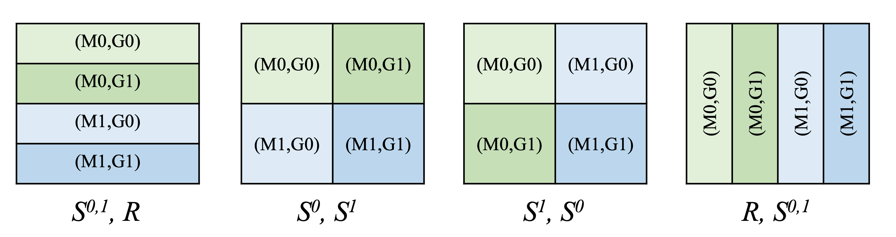

- Feature Name: `auto-parallelization`
- Start Date: 2023-07-27
- RFC PR:
- GitHub Issue: https://github.com/hidet-org/hidet/issues/335

# Summary
[summary]: #summary

In order to support the distributed inference of large models that potentially exceed the memory
limit of a single GPU, we hope to implement a seamless API that shards a huge whole computational
graph into several smaller partitions. It should be able to find the optimal sharding strategy that
minimizes the communication cost.

# Motivation
[motivation]: #motivation

To support distributed inference for arbitrary models while requiring minimal code modification by 
users. Currently, we mainly focus on tensor parallelism on single-machine-multi-gpu settings, but 
the user interface and data structure should be designed to be compatible with other kinds of
parallelism and be extensible.

# Guide-level explanation
[guide-level-explanation]: #guide-level-explanation

Given a FlowGraph `g`, the user can call `hidet.distributed.partition` to shard it into multiple 
partitions (more specifically, multiple `FlowGraphs`), and save them into the disk. Each partition 
can be optimized and compiled independently.
``` python
g: FlowGraph = build_flow_graph_from_original_model(...)              
hidet.distributed.partition(g, distributed_config, out_dir)
```

Distributed inference can be launched in a multi-processing paradigm. Each process occupies a GPU
and will be assigned a unique `rank` representing the id of the process. Graph Partitioning happens
in only one of the processes (assume `rank0` here). After partitioning is finished (we use 
`barrier` to sync up all processes here), each process loads its corresponding partition from the
disk and does optimization and compilation. Also the partitioning provides some meta information
(`meta-info`) which is used to initialize the distributed environment (`hidet.distributed.init`).

``` python
# run on multiple ranks concurrently
def init_distributed_inference( 
    optimization_config, distrbuted_config, rank
):
    if rank == 0:
      g: FlowGraph = build_flowgraph()
      # generates multiple flowgraphs and saves to disk
      hidet.distributed.partition(g, distrbuted_config, out_dir)
    
    hidet.distributed.barrier()
    model, meta_info = \
          hidet.distributed.load_partition(out_dir, rank)

    # optimize the model
    opt_model = optimize(optimization_config)
    
    # initializes nccl comms
    hidet.distributed.init(meta_info)
```

`distributed_config` and `optimization_config` are two dictionaries that contain options for
partitioning and compilation.

``` python
optimization_config = {
  "space": 2,
  "reduce_type": "f16",
  "recompile": False,
  ...
}

distributed_config = {
  "ngpus": 2,
  "parallel_type": "tp", # now we only support tensor parallel
}

```

# Reference-level explanation
[reference-level-explanation]: #reference-level-explanation

The most important API here is `hidet.distributed.partition`. It partitions the whole computational
graph into smaller partitions according to `distributed_config` and save them into the disk,
together with some meta information (saved as a `dict`) used to initialize the distributed runtime
environment.

``` python
hidet.distributed.partition(g: FlowGraph, distributed_config: dict)
```

It carries out two steps: 1) Find the optimal partitioning strategy and annotate the sharding
specification of each operator, and 2) partition weight matrices and inject communication operators
into the partitioned graph.

To start with, we first introduce the data structure for sharding annotation. It consists of two
layers, namely tensor sharding specification and operator sharding specification.

## Key Data Structures

### Tensor Sharding Specification

Tensor sharding specfications specify how to shard a tensor, such as row-wise or column-wise.

Following Alpa’s design[1], we assume that the possible sharding space should be **aligned with the
real hardware hierarchy**. The number of sharding levels should not exceed the depth of the hardware
hierarchy, and the number of shards at each level should be equal to the number of devices at that
level. Therefore, using R or Si is sufficient since the number of shards is determined by the number
of devices. For example, for a 2x2 multi-machine-multi-GPU cluster, the possible sharding
 specifications are shown in the following figure (M means machine and G means GPU).
 These sharding specifications can be written as $(S^{0,1}, R)$, $(S^0, S^1)$, $(S^1, S^0)$, $(R, S^{0,1})$.



For disambiguation, we adopt a convention that **dimension** refers to the dimension or axis of the
tensor, and **mesh axis** refers to the axis of hardware hierarchy.

The data structure to represent a tensor sharding specification can be that each dimension of the
tensor is labeled with a set of integers, which represent the hardware axes this dimention is
sharded to. For example, the sharding specifications mentioned above can be represented as `({0,1},
{})`, `({0}, {1})`, `({1}, {0})`, `({}, {0,1})`. We can add conversions from/to strings for better
readability.

``` python
class TensorShardSpec:
    mesh_axis_per_dim: List[Set[int]]
```

Currently, we mainly consider 1D partitioning, which corresponds to single-machine-multiple-GPU
settings, so we will provide an API to create a tensor sharding specification by merely specifying
which dimension to be sharded.


### Operator Sharding Specification

Operator sharding specifications specify how to *shard* an operator. One tricky issue here is how to
define *sharding* of an operator, and please refer to [this](#rationale-and-alternatives) for the
reason of our design. In our design, the sharding of one operator can be represented by the sharding
specifications of all its inputs and outputs, together with the reduction functions of each output.

``` python
class OpShardSpec:
    in_specs: List[TensorShardSpec]
    out_specs: List[TensorShardSpec]
    reduce_fns: List[ReduceFunction]
```

The semantics of an operator sharding specification is that if the input tensors are sharded
according to their specification, when after being reduced by the reduction functions, the output
tensors of the operator are also sharded as the output specification. More formally

$$
o_i = op(inputs)_i
$$

$$
out_i = \text{reduce-fn}_i(o_i)
$$

Take matrix multiplication as an example, for a matmul $C_{i, j}=\sum_k A_{i, k} x B_{k, j}$, there
are three 1D sharding strategies: sharding along $i$, $j$, and $k$.

|               | in_specs (A,B) | out_specs (C)  | reduce_fns (C) |
| ------------- | -------------- | -------------- | -------------- |
| Shard along i | SR, RR         | SR             | None           |
| Shard along j | RR, RS         | RS             | None           |
| Shard along k | RS, SR         | SR (row-major) | reduce_scatter |
|               |                | RR             | all_reduce     |

Sharding along $i$ or $j$ is purely spatial and no partial results need to be reduced. Sharding
along k is a little bit subtle since the computation result is partial. We need to sum up the result
of all devices to get the final result. It can either be `all_reduce`, after which each device will
have a copy of the complete result. or it can be `reduce_scatter`, after which each device will have
a shard of the final result.

We can either manually write sharding specifications for each type of op (as in Alpa[1]), or build an
automatic specification discovery tool.

## Shared Operator Connection

In our design, an operator can be annotated with any valid sharding specifications. It will lead to
a problem that the tensor required as an input by other operators can have different sharding
specifications where the tensor is produced as an output. Therefore, a `connect` function should
be implemented to figure out the correct conversion operation (other slicing or communication ops),
and estimate the required communication cost (which is used to find the optimal sharding strategy).
```python
comm_op, comm_cost = connect(src_tensor_spec, dst_tensor_spec) 
```

## Sharding Strategy Searching

We follow Alpa's[1] practice to model searching the optimal sharding strategy as an ILP problem. The
coefficients required by ILP are obtained by the `connect` function mentioned in the last section.
The ILP is formed as:

$$
\min_{s} \sum_{v\in V} s_v^\top(c_v + d_v) + \sum_{(v,u)\in E}s_v^\top R_{v,u} s_u
$$

where $V$ stands for nodes(operator), $E$ for edges between nodes, $s_v$ for the one-hot vector
representing which sharding specification is chosen for the operator $v$. $c_v$ is the communication
cost of the $v$ (more specifically, it is a vector of which each entry is the communication cost of
a sharding specification). $d_v$ is the computation cost for $v$, and Alpa assumes they are all
zero. $R_{v,u}$ is the communication cost for shard conversion between $v$ and $u$, which is given
by the `connect` function.

It will produce a dict `Dict[Operator, OpShardSpec]` mapping each op to its assigned sharding
specification, which is used in parameter sharding and communication op injection.

## Parameter Sharding and Communication Op Injection

A graph pass is used to shard the parameters and inject necessary communication operators to the
flowgraph, which relies on the `connect` function.


# Drawbacks
[drawbacks]: #drawbacks
 

# Rationale and alternatives
[rationale-and-alternatives]: #rationale-and-alternatives

## Operator Sharding Specification

**Why define OpShardSpec like this?**

Let us first think about what *sharding an operator* means. In our design, a sharded operator means
an operator that takes sharded inputs, **executes the same code of the original operator**, and
produces sharded outputs. The reason why we emphasize **the same code** here is we do not want to
include the following cases in our search space:

- Full inputs produce partial outputs. For example, we have a 1D vector $x$ and we want to calculate
  $x+1$. If we want only the first half of the output, it is valid to modify the original op so that
  it takes the full $x$ as input and only produces the first half $x+1$. If we do not eliminate this
  case, then $R \rightarrow S$ will also be a valid op sharding specification. Though theoretically
  valid, actually carrying out the code modification (involving index transformation, etc) is
  non-trivial. Also this case can be covered by using `connect` function to slice the full inputs to
  sharded inputs. So it is unnecessary to consider this kind of sharding.

We find this assumption is very practical and makes the definition very clear.

**If so, out_specs are totally determined by in_specs, then why do we need out_specs?**

It is correct that if we constraint that the sharded op uses exactly the same code as the original
op, the shape of the outputs is also determined so that out_specs are actually redundant. However,
we do not want to run or analyze the op every time we need out_specs, so they are materialized.

**Why inlcude reduction function in OpShardSpec?**

One assumption is partial results should be reduced immediately after the computation of the op, and
that’s why we bind the reduction of partial results with the op sharding specs. Allowing partial
results to exist in the computational graph is dangerous and it’s hard to guarantee its correctness.
For example, assuming $s = s_1 + s_2$ where $s_1$ and $s_2$ are the partial results, we have 
$(s + 1) \neq (s_1 + 1) + (s_2 + 1)$. Even the simplest element-wise operator cannot be fused with 
partial results, so we assume separating partial results and reduction would not introduce any useful
optimizations.

Contrarily,  spatial sharding is more friendly to many ops like element-wise ops and layer norm, and
can always be reconstructed when needed.

# Prior art
[prior-art]: #prior-art


# Unresolved questions
[unresolved-questions]: #unresolved-questions

- How to represent reduction functions? Should we use reduce-scatter by default? Since all-reduce
  can be decomposed as reduce-scatter and all-gather, and the latter can be covered by the `connect`
  function. Currently we use enum to distinguish these two reduction functions.
- Should we consider modeling computation cost in the ILP? For example, if we're using GPUs with large
  memory and low computing capability we may still want to shard computation-intensive operators.

Many other potential questions remain undiscovered and will show up during the development.


# Future possibilities
[future-possibilities]: #future-possibilities

- How to support multi-machine-multi-gpu settings?


# Reference

[1] Zheng, Lianmin, et al. "Alpa: Automating inter-and {Intra-Operator} parallelism for distributed deep learning." 16th USENIX Symposium on Operating Systems Design and Implementation (OSDI 22). 2022.
